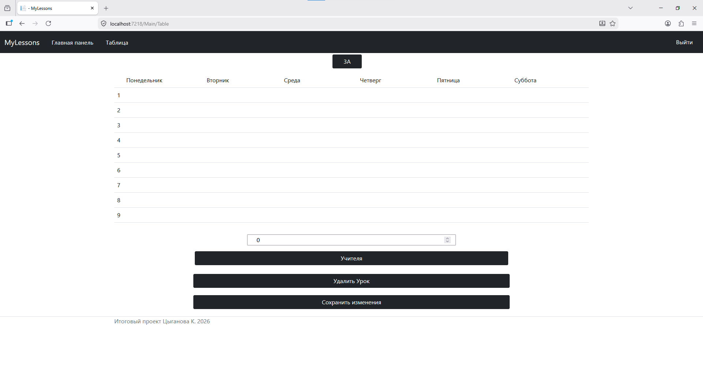
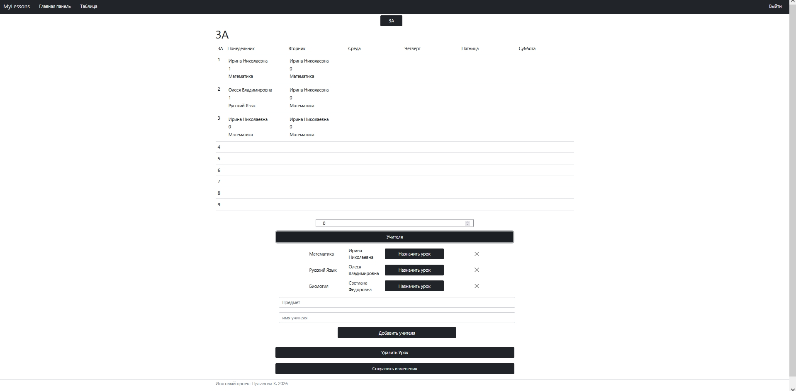
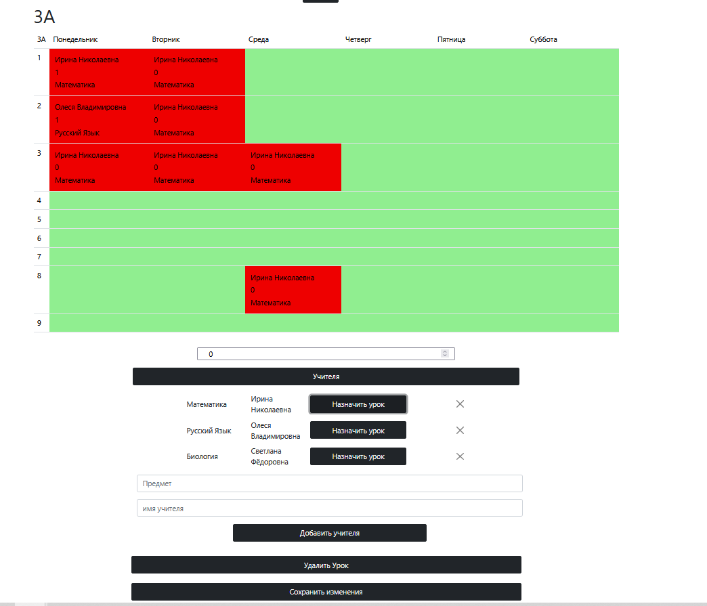
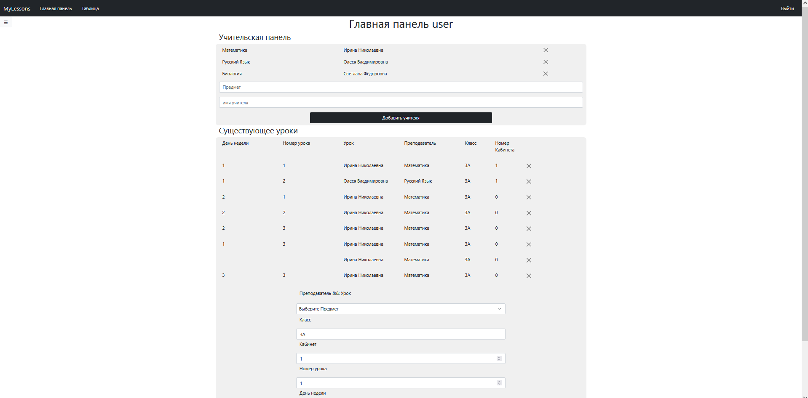
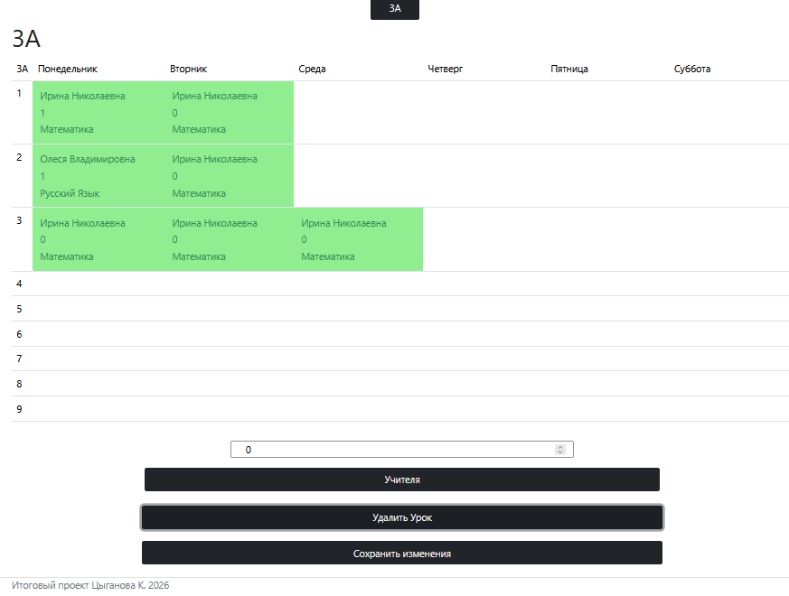
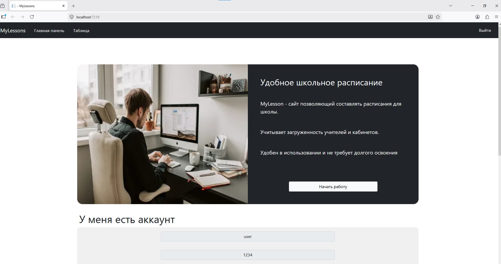
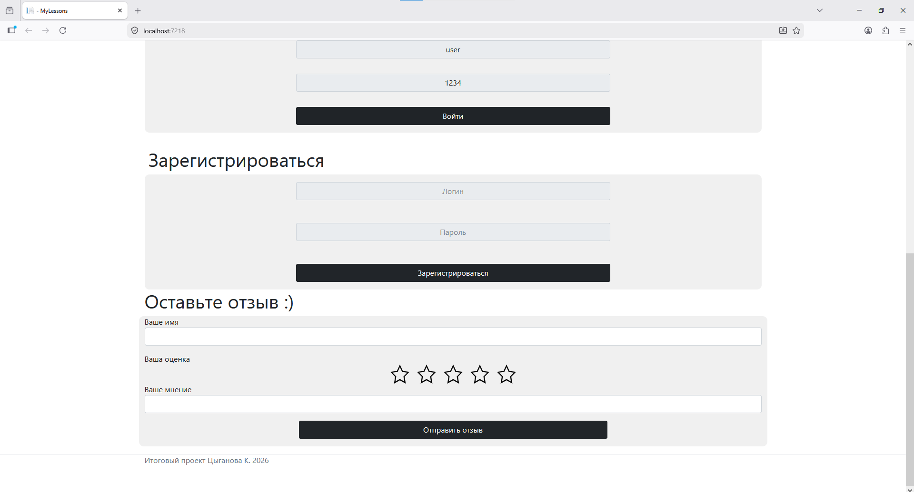

📖 MyLesson
=========
### what is it? 🧑‍💻
- This website makes it easier to plan your school activities and reduces the time it takes
### What are its advantages over other websites? 📈
- Easy to learn
- it has a simple design based on bootstrap 4, which gives the screen a clean look
- Absolutely free and without ads!
### Functional
- Button "Начать работу": When you click the button, the registration and login forms are displayed on the screen
# awe
- Easy to learn
- it has a simple design based on bootstrap 4, which gives the screen a clean look
- Absolutely free and without ads!

## Screenshots

|  |  |  |
|-------------------------------------------------------|-------------------------------------------------------|-------------------------------------------------------|
|  |  |  |
|  |                                                       |                                                       |

## SQL Code
```
-- MySQL Script generated by MySQL Workbench
-- Sun Feb 15 22:16:11 2026
-- Model: New Model    Version: 1.0
-- MySQL Workbench Forward Engineering

SET @OLD_UNIQUE_CHECKS=@@UNIQUE_CHECKS, UNIQUE_CHECKS=0;
SET @OLD_FOREIGN_KEY_CHECKS=@@FOREIGN_KEY_CHECKS, FOREIGN_KEY_CHECKS=0;
SET @OLD_SQL_MODE=@@SQL_MODE, SQL_MODE='ONLY_FULL_GROUP_BY,STRICT_TRANS_TABLES,NO_ZERO_IN_DATE,NO_ZERO_DATE,ERROR_FOR_DIVISION_BY_ZERO,NO_ENGINE_SUBSTITUTION';

-- -----------------------------------------------------
-- Schema myLesson
-- -----------------------------------------------------

-- -----------------------------------------------------
-- Schema myLesson
-- -----------------------------------------------------
CREATE SCHEMA IF NOT EXISTS `myLesson` DEFAULT CHARACTER SET utf8 COLLATE utf8_czech_ci ;
USE `myLesson` ;

-- -----------------------------------------------------
-- Table `myLesson`.`user`
-- -----------------------------------------------------
CREATE TABLE IF NOT EXISTS `myLesson`.`user` (
  `id` INT NOT NULL AUTO_INCREMENT,
  `login` VARCHAR(45) NOT NULL,
  `password` VARCHAR(45) NOT NULL,
  PRIMARY KEY (`id`))
ENGINE = InnoDB;


-- -----------------------------------------------------
-- Table `myLesson`.`data`
-- -----------------------------------------------------
CREATE TABLE IF NOT EXISTS `myLesson`.`data` (
  `id` INT NOT NULL AUTO_INCREMENT,
  `text` TEXT NOT NULL,
  `teacher` TEXT NOT NULL,
  PRIMARY KEY (`id`))
ENGINE = InnoDB;


SET SQL_MODE=@OLD_SQL_MODE;
SET FOREIGN_KEY_CHECKS=@OLD_FOREIGN_KEY_CHECKS;
SET UNIQUE_CHECKS=@OLD_UNIQUE_CHECKS;
```
